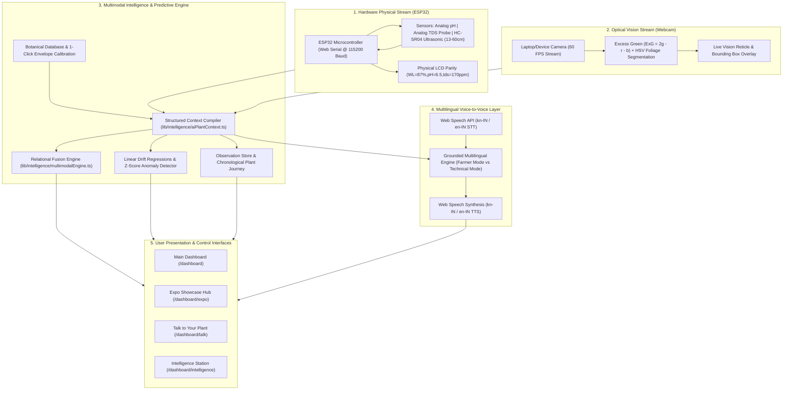

# 🌿 HydroSmart: Multimodal Intelligent Hydroponics Platform
## Comprehensive System Architecture, Engineering Documentation & Phase Changelog

---

## 📌 1. Executive Summary & Vision

**HydroSmart** has evolved from an IoT sensor dashboard into a production-ready, **multimodal intelligent hydroponics monitoring and agricultural decision-support ecosystem**. 

Designed to bridge physical IoT hardware with state-of-the-art browser-based computer vision and conversational AI, HydroSmart unifies:
1. **Real-time ESP32 physical chemistry & ultrasonic reservoir telemetry** via high-speed Web Serial API.
2. **Edge-computed optical computer vision** utilizing laptop/mobile webcams for 60 FPS foliage detection and 4-factor visual stress diagnostics.
3. **Botanical taxonomic classification** and dynamic crop profile calibration.
4. **Relational multimodal health assessment** strictly differentiating sensory facts from interpretations and agronomic reasoning.
5. **Longitudinal plant memory & chronological journey timeline** with image-derived optical canopy expansion tracking.
6. **Time-series predictive analytics** calculating drift velocities ($\Delta/\text{day}$) and days-to-threshold forecasts alongside statistical Z-score outlier detection.
7. **Single-source-of-truth grounding layer (`StructuredPlantContext`)** eliminating AI hallucinations and preventing unsupported biological disease claims.
8. **Interactive "Talk to Your Plant" experience** (`/dashboard/talk`).
9. **Exhibition-ready Expo Mode** (`/dashboard/expo`) structured around the core 6-stage pipeline: **OBSERVE $\rightarrow$ ANALYZE $\rightarrow$ UNDERSTAND $\rightarrow$ PREDICT $\rightarrow$ RECOMMEND $\rightarrow$ INTERACT**.
10. **Multilingual Voice-to-Voice Farmer Assistant** natively supporting **Kannada (`kn-IN`)** and **English (`en-IN`)** with speech-to-text, context grounding, text-to-speech synthesis, and simplified **Farmer Mode**.

---

## 🏗️ 2. High-Level System Architecture



---

## 🔬 3. Mathematical & Algorithmic Foundations

### A. Ultrasonic Reservoir Distance-to-Water Level Calibration
The physical tank geometry is calibrated to exact hardware specifications:
- **Full Tank Distance**: $13.0\text{ cm}$
- **Empty Tank Distance**: $60.0\text{ cm}$
- **Calculated Water Level Percentage**:
  $$\text{WL}\% = \max\left(0, \min\left(100, \frac{60.0 - d_{\text{measured}}}{60.0 - 13.0} \times 100\right)\right)$$

### B. Optical Chlorophyll Vegetation Index (Excess Green — ExG)
For real-time 60 FPS foliage detection and bounding box computation without heavy server GPU overhead, the normalized Excess Green algorithm is computed on the canvas frame buffer:
$$r = \frac{R}{R+G+B}, \quad g = \frac{G}{R+G+B}, \quad b = \frac{B}{R+G+B}$$
$$\text{ExG} = 2g - r - b$$
$$\text{Foliage Condition} = \begin{cases} \text{Vibrant Green} & \text{if } \text{ExG} \ge 0.15 \\ \text{Pale Foliage} & \text{if } 0.05 \le \text{ExG} < 0.15 \\ \text{Chlorosis Alert} & \text{if } \text{ExG} < 0.05 \text{ and Yellow Ratio} > 0.18 \end{cases}$$

### C. 4-Factor Visual Health Decomposition Model
$$\text{Visual Health Score} = 0.35 \times S_{\text{color}} + 0.25 \times S_{\text{uniformity}} + 0.20 \times S_{\text{vigor}} + 0.20 \times (100 - P_{\text{anomalies}})$$

### D. Time-Series Parameter Drift Rate (Linear Regression)
For parameter sequence $y_i$ across timestamp delta $t_i$ (in days):
$$\text{Drift Rate } (\Delta/\text{day}) = \frac{N \sum (t_i y_i) - \sum t_i \sum y_i}{N \sum t_i^2 - (\sum t_i)^2}$$
$$\text{Estimated Days to Threshold} = \frac{\text{Threshold} - y_{\text{current}}}{\text{Drift Rate}}$$

### E. Continuous Z-Score Anomaly Outlier Detection
$$Z = \frac{x_{\text{current}} - \mu_{7\text{d}}}{\sigma_{7\text{d}}}, \quad \text{Flagged as Anomaly if } |Z| \ge 2.0$$

---

## 📚 4. Complete Phase-by-Phase Changelog

### Phase 1 — HydroSmart Intelligence Foundation
- Created the core TypeScript contracts in [`lib/intelligence/types.ts`](file:///d:/major%20project/smart-hydroponics/lib/intelligence/types.ts).
- Established local observation storage schema under key `hydrosmart_plant_observations_v1`.
- Built modular evaluation engines for pH, TDS, and water level against crop-specific envelope profiles.

### Phase 2 — Live Plant Camera Monitoring
- Built [`lib/camera/CameraContext.tsx`](file:///d:/major%20project/smart-hydroponics/lib/camera/CameraContext.tsx) for WebRTC camera stream acquisition, device enumeration, and instant frame capturing.
- Implemented real-time foliage segmentation and bounding box detection in [`lib/vision/plantDetector.ts`](file:///d:/major%20project/smart-hydroponics/lib/vision/plantDetector.ts) running at 60 FPS.
- Built live computer vision viewport HUD with animated scanlines, reticle tags, and FPS telemetry.

### Phase 3 — Botanical Plant Species Identification
- Created comprehensive botanical taxonomic database in [`lib/intelligence/botanicalDatabase.ts`](file:///d:/major%20project/smart-hydroponics/lib/intelligence/botanicalDatabase.ts) covering Butterhead Lettuce, Sweet Basil, Spinach, Mint, Kale, Strawberries, and Cherry Tomatoes.
- Built ranked botanical identification engine in [`lib/intelligence/plantIdentification.ts`](file:///d:/major%20project/smart-hydroponics/lib/intelligence/plantIdentification.ts).
- Added 1-Click Profile Recalibration: applying an identified species automatically resets target pH/TDS envelopes across the entire dashboard.

### Phase 4 — Visual Plant Health & Stress Diagnostics
- Developed 4-Factor Visual Health scoring engine in [`lib/vision/plantHealthAnalyzer.ts`](file:///d:/major%20project/smart-hydroponics/lib/vision/plantHealthAnalyzer.ts).
- Detected optical chlorosis (yellowing), necrotic browning, and canopy vigor loss.
- Maintained safety protocol: explicitly titled as *Visual Plant Health / Stress Analysis* without making unverified disease claims.

### Phase 5 — Multimodal Plant Health Engine
- Created relational data fusion engine in [`lib/intelligence/multimodalEngine.ts`](file:///d:/major%20project/smart-hydroponics/lib/intelligence/multimodalEngine.ts) correlating Camera Vision + ESP32 Telemetry + Historical Trends.
- Enforced strict epistemological separation across 3 dedicated display categories:
  - **Sensory Observations**: Direct physical & visual measurements.
  - **Cross-Domain Interpretations**: Inferred interactions between chemistry and optical status.
  - **Agronomic Explanations**: Biological reasoning grounding all findings.

### Phase 6 — Plant Growth Tracking & Longitudinal Memory
- Implemented persistent observation store in [`lib/intelligence/observationStore.ts`](file:///d:/major%20project/smart-hydroponics/lib/intelligence/observationStore.ts).
- Built optical growth modeling in [`lib/intelligence/plantMemory.ts`](file:///d:/major%20project/smart-hydroponics/lib/intelligence/plantMemory.ts) tracking 2D canopy spread ($\Delta\text{Canopy Area}\%$, velocity $\%/\text{day}$).
- Created **PLANT JOURNEY** chronological milestone timeline displaying snapshot photos, dates, health scores, and water parameters.
- Implemented retrospective memory Q&A (*"How has the plant changed?"*, *"Is the plant healthier than earlier?"*, *"What changed recently?"*).

### Phase 7 — Predictive Analytics & Recommendation Engine
- Created time-series rate-of-change regressions in [`lib/intelligence/predictiveAnalytics.ts`](file:///d:/major%20project/smart-hydroponics/lib/intelligence/predictiveAnalytics.ts) for pH, TDS, and water level.
- Built time-to-threshold countdown meters estimating days until parameter exhaustion or boundary violation.
- Implemented rolling mean and standard deviation Z-score outlier detection.
- Generated prioritized grower action cards labeled *ADVISORY GUIDANCE ONLY — MANUAL GROWER ACTION REQUIRED*.

### Phase 8 — Context-Aware AI Plant Companion
- Built single-source-of-truth compiler in [`lib/intelligence/aiPlantContext.ts`](file:///d:/major%20project/smart-hydroponics/lib/intelligence/aiPlantContext.ts) generating `StructuredPlantContext`.
- Created grounded AI query resolver in [`lib/intelligence/aiPlantEngine.ts`](file:///d:/major%20project/smart-hydroponics/lib/intelligence/aiPlantEngine.ts) with epistemic badging (`[✓ Measured Fact]`, `[👁 Visual Observation]`, `[📈 Time-Series Projection]`, `[💡 Grower Advisory]`).
- Added interactive Context JSON Inspector enabling direct examination of the ground-truth payload grounding the AI.

### Phase 9 — Talk to Your Plant Experience
- Created dedicated interactive view at [`app/dashboard/talk/page.tsx`](file:///d:/major%20project/smart-hydroponics/app/dashboard/talk/page.tsx).
- Unified live webcam stream, bounding box HUD, health score gauge, environmental telemetry grid, and conversational interface.
- Supported 7 one-click prompt inquiry chips for instant interaction.
- Linked **Talk to Plant** in the main sidebar navigation.

### Phase 10 — HydroSmart Expo Mode & Exhibition Presets
- Built exhibition console at [`app/dashboard/expo/page.tsx`](file:///d:/major%20project/smart-hydroponics/app/dashboard/expo/page.tsx).
- Structured the entire system around the 6-stage presentation pipeline:
  **OBSERVE $\rightarrow$ ANALYZE $\rightarrow$ UNDERSTAND $\rightarrow$ PREDICT $\rightarrow$ RECOMMEND $\rightarrow$ INTERACT**.
- Provided 5 controlled demonstration presets in [`lib/intelligence/demoScenarios.ts`](file:///d:/major%20project/smart-hydroponics/lib/intelligence/demoScenarios.ts):
  `HEALTHY`, `PH DRIFT`, `TDS DECLINE`, `WATER DEPLETION`, and `SENSOR ANOMALY`.
- Prominently labeled data sources as `● LIVE ESP32 HARDWARE` or `● DEMO MODE (SIMULATED SCENARIO)`.

### Phase 11 — Multilingual Voice-to-Voice Farmer Assistant
- Created centralized language configuration in [`lib/voice/voiceConfig.ts`](file:///d:/major%20project/smart-hydroponics/lib/voice/voiceConfig.ts) supporting **Kannada (`kn-IN`)** and **English (`en-IN`)**.
- Built Web Speech API Speech-to-Text abstraction in [`lib/voice/speechToText.ts`](file:///d:/major%20project/smart-hydroponics/lib/voice/speechToText.ts).
- Built Web Speech Synthesis Text-to-Speech abstraction in [`lib/voice/textToSpeech.ts`](file:///d:/major%20project/smart-hydroponics/lib/voice/textToSpeech.ts) with immediate `stopSpeaking()` interruption control.
- Built [`lib/voice/multilingualAssistantEngine.ts`](file:///d:/major%20project/smart-hydroponics/lib/voice/multilingualAssistantEngine.ts) resolving farmer queries in Kannada and English.
- Implemented **Farmer Mode** (simple, actionable) and **Technical Mode** (exact numbers and drift rates).
- Built complete voice component suite in [`components/voice/`](file:///d:/major%20project/smart-hydroponics/components/voice/) (`PlantVoiceAssistant`, `VoiceButton`, `VoiceStatus`, `LanguageSelector`, `TranscriptView`).
- Embedded the voice assistant seamlessly into [`app/dashboard/talk/page.tsx`](file:///d:/major%20project/smart-hydroponics/app/dashboard/talk/page.tsx).

---

## 🗂️ 5. Project Directory & File Map

```
smart-hydroponics/
├── app/
│   ├── api/
│   │   ├── pump-control/route.ts       # Manual pump control endpoint
│   │   ├── simulate/route.ts           # Demo scenario simulator stream
│   │   └── telemetry/route.ts          # Telemetry ingestion endpoint
│   ├── dashboard/
│   │   ├── alerts/page.tsx             # Threshold alerts page
│   │   ├── analytics/page.tsx          # Historical analytics charts
│   │   ├── control/page.tsx            # Actuator manual control
│   │   ├── expo/                       # Phase 10: Expo Showcase Hub
│   │   │   ├── page.tsx
│   │   │   └── page.module.css
│   │   ├── hardware/page.tsx           # Hardware pinout & sensor wiring
│   │   ├── intelligence/               # Multimodal Intelligence Dashboard
│   │   │   ├── page.tsx
│   │   │   └── page.module.css
│   │   ├── profile/page.tsx            # Station profile & targets
│   │   ├── talk/                       # Phase 9 & 11: Talk to Your Plant & Voice Assistant
│   │   │   ├── page.tsx
│   │   │   └── page.module.css
│   │   ├── layout.tsx                  # Dashboard layout & security gate
│   │   └── page.tsx                    # Live monitoring dashboard
│   ├── login/page.tsx                  # User authentication
│   ├── signup/page.tsx                 # Account registration
│   ├── layout.tsx                      # Root HTML layout
│   └── page.tsx                        # Brand intro / landing page
│
├── components/
│   ├── voice/                          # Phase 11: Voice Assistant Component Suite
│   │   ├── LanguageSelector.tsx        # Kannada / English language dropdown
│   │   ├── PlantVoiceAssistant.tsx     # Master voice-to-voice orchestrator
│   │   ├── PlantVoiceAssistant.module.css # Voice UI stylesheet
│   │   ├── TranscriptView.tsx          # Live transcript & speech bubble stream
│   │   ├── VoiceButton.tsx             # Animated microphone button (idle/listen/speak)
│   │   └── VoiceStatus.tsx             # Localized status labels & sublabels
│   ├── Navbar.tsx                      # Top navigation bar
│   ├── Sidebar.tsx                     # Main sidebar navigation (Dashboard, Expo, Talk, Intel)
│   ├── MetricsCard.tsx                 # Real-time metric display card
│   └── PumpControl.tsx                 # Relay actuator widget
│
├── lib/
│   ├── camera/
│   │   ├── CameraContext.tsx           # WebRTC camera provider & device switcher
│   │   └── usePlantMonitor.ts          # Real-time continuous canvas scan hook
│   ├── esp32/
│   │   └── ESP32SerialContext.tsx      # Web Serial connection manager (115200 baud)
│   ├── intelligence/
│   │   ├── aiPlantContext.ts           # StructuredPlantContext single-source-of-truth compiler
│   │   ├── aiPlantEngine.ts            # Grounded conversational reasoning engine
│   │   ├── anomalyDetection.ts         # Real-time environmental anomaly flags
│   │   ├── botanicalDatabase.ts        # Botanical taxonomic database & targets
│   │   ├── demoScenarios.ts            # 5 exhibition demo scenario presets
│   │   ├── healthScore.ts              # Environmental & composite scoring engine
│   │   ├── multimodalEngine.ts         # Cross-domain relational data fusion
│   │   ├── observationStore.ts         # Persistent observation storage manager
│   │   ├── plantIdentification.ts      # Optical plant species classifier
│   │   ├── plantMemory.ts              # Growth modeling & Plant Journey compiler
│   │   ├── predictiveAnalytics.ts      # Linear drift regressions & Z-score anomalies
│   │   ├── PlantIntelligenceContext.tsx# Master intelligence React state provider
│   │   └── types.ts                    # Global intelligence TypeScript types
│   ├── voice/
│   │   ├── multilingualAssistantEngine.ts # Multilingual response generator (Kannada/English)
│   │   ├── speechToText.ts             # Web Speech API STT abstraction
│   │   ├── textToSpeech.ts             # Web Speech Synthesis TTS abstraction
│   │   └── voiceConfig.ts              # Centralized language & voice configurations
│   ├── firebase.ts                     # Firebase authentication & Firestore client
│   └── simulator.ts                    # Physiological telemetry simulation engine
│
├── PROJECT_COMPREHENSIVE_DOCUMENTATION.md # Master project documentation report
└── walkthrough.md                      # Continuous implementation walkthrough
```

---

## 🛡️ 6. Reliability, Safety & Epistemological Standards

1. **Zero Hallucination Protocol**:
   - The AI Plant Companion and Voice Assistant strictly source data from `StructuredPlantContext`.
   - If an ESP32 sensor is disconnected or camera is inactive, the system explicitly communicates: *"I cannot read the latest water data because the ESP32 is disconnected."* (English) / *"ESP32 ಸೆನ್ಸರ್ ಸಂಪರ್ಕದಲ್ಲಿಲ್ಲದ ಕಾರಣ..."* (Kannada). Missing metrics are **never** fabricated.

2. **No Unsupported Biological Disease Diagnoses**:
   - Visual abnormalities are framed as **Visual Stress Indicators** (e.g. *"The camera detected visual indicators that may indicate stress"*).
   - The system never outputs unscientific disease claims.

3. **Advisory-Only Action Guidance**:
   - Since no motorized chemical dosing pumps are attached to the reservoir, all recommendations are clearly labeled: **ADVISORY GUIDANCE ONLY — MANUAL GROWER ACTION REQUIRED**.

4. **Epistemic Badge Transparency**:
   - All diagnostic outputs are badged:
     - `[✓ Measured Fact]`: Exact physical sensor measurements (pH, TDS, Water Level, Distance).
     - `[👁 Visual Observation]`: Camera vision analyses (Canopy %, Visual Score, Foliage condition).
     - `[📈 Time-Series Projection]`: Mathematical drift rates and countdown estimates.
     - `[💡 Grower Advisory]`: Prioritized actions for manual human implementation.

---

## 🚀 7. Build, Verification & Deployment Status

- **Framework**: Next.js 16.2.4 with Turbopack & React 19
- **Type Checker (`npx tsc --noEmit`)**: ✅ **0 Errors**
- **Linter (`npm run lint`)**: ✅ **0 Errors**
- **Production Build (`npm run build`)**: ✅ **Exit Code 0** (All 19 routes statically/dynamically generated)
- **Deployment Platform**: Vercel (`main` branch synchronized with GitHub `Chitesh09/smart-hydroponics`)
